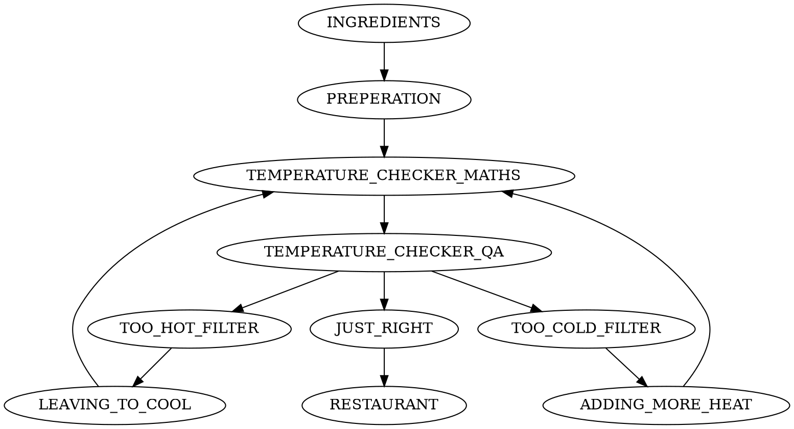
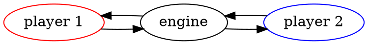

# Pipeawesome

## As my mum would say... accusingly... "WHAT did YOU do?!?!?!"

I added loops, branches and joins to UNIX pipes.

## Why did you do this?

UNIX pipes are wonderful as when you write software using them they have:

 * High performance.
 * Back Pressure.
 * Buffering.
 * Really easy to reason about at the individual UNIX process level (it's just STDIN and STDOUT/STDERR).
 * Easy to reason about what data enters individual processes.
 * Insanely light and zero infrastructure compared to a "proper" solution.
 * Easily to integrate with a "proper" solution when the need arises.

I also feel that joining different pieces of software together using pipes is very much in the spirit of UNIX and, depending on the situation, is also similar to microservices.

## An actually implemented example (if so basic as to be pointless)

Imagine you own a restaurant and you want to check the temperature of soup as it leaves the kitchen:


This could be specified with the configuration file below:

```javascript file=examples/temperature_prope.paspec.json5
```

To run this file you do the following:

```bash
$  echo -e "44\n90\n92\n99\n33" | ./target/debug/pipeawesome \
        -n -p "$(cat examples/temperature_prope.paspec.json5 | json5)" \
        -i KITCHEN=- -o RESTAURANT=-
TOO_COLD:44
JUST_RIGHT:90
JUST_RIGHT:92
TOO_HOT:99
TOO_COLD:33
```

NOTE 1: `-o RESTAURANT=-` means the output "RESTAURANT" should go to STDOUT.
You can also use an underscore (`_`) to mean STDERR. If it is neither of
these it will be interpreted as a filename which will be wrote to.

NOTE 2: Without `-n` the `-p` parameter is a filename which must be valid JSON. I wanted to use JSON5 here so I could add meaningful comments, hence the `-n`, `-p` `cat` combination.

## An example which shows how real value could be realized.

Of course, the `TEMPERATURE_CHECKER` probably should send soup that is either too hot, or too cold back to the kitchen where it will either be left to cool or heated up some more:




```javascript file=examples/soup_back_to_kitchen.paspec.json5
```

```bash
$ ./target/debug/pipeawesome -p "$(cat examples/soup_back_to_kitchen.paspec.json5 | json5)" \
        -i INGREDIENTS=tests/pipeawesome/soup_temperature.input.txt \
        -o RESTAURANT=-
4: JUST_RIGHT: 4 + 51 + 2 + 33: 90
3: JUST_RIGHT: 54 + 9 + 26: 89
2: JUST_RIGHT: 56 + 22 + 66 - 6 - 4 - 3 - 7 - 1 - 5 - 3 - 7 - 7 - 4 - 2 - 3: 92
5: JUST_RIGHT: 1 + 1 + 1 + 26 + 29 + 29 + 18 - 4 - 2 - 7: 92
1: JUST_RIGHT: 12 + 5 + 25 + 8 + 16 + 5 + 28 - 5 - 6: 88
^C
```
NOTE: We explain why we had to CTRL-C later on.

### But why did we have to CTRL-C when all the data had been processed?

Pipeawesome will exit when all outputs have been closed (or programs which have no outgoing connections have exited).

In Pipeawesome, when a programs exits, it's output is closed, so we close STDIN for the next program, which could (when it has finished processing) then exit and its output is closed. Of course when each program finishes processing is at some indeterminate point in the future and not necessarily related to it's input.

The "problem" occurs when there is a loop. In the example above "PREPERATION" has closed it's own STDOUT but "TEMPERATURE_CHECKER_MATHS" has two more inputs. If you follow it back for one branch:

 * To close "LEAVING_TO_COOL", "TOO_HOT_FILTER" would need to close.
 * To close "TOO_HOT_FILTER", "TEMPERATURE_CHECKER_QA" would need to close.
 * To close "TEMPERATURE_CHECKER_QA", it's own input needs to be closed, which is "TEMPERATURE_CHECKER_MATHS"... which is not going to happen.

This may not be a problem for some software (like server or desktop software) which you may want to keep open. But for tools on the command line it doesn't work very well.

In the above example "PREPERATION" added line numbers to the very beginning of a line. If we want Pipeawesome to exit all we need to do is add a program between "JUST_RIGHT" and "RESTAURANT" which compares those numbers from "PREPERATION" with the ones flowing through itself and closes when it has seen them all.

There are trade-offs writing this program, as we don't know how many numbers there will be but there is a trivial implementation in `pipeawesome-terminator` as well as an example usage which adds just 3 commands in [./examples/perfect_soup.paspec.json](./examples/perfect_soup.paspec.json).

## What are you hoping to achieve?

### My original reason for building this

I have recently created two projects:

 * [eSQLate](https://github.com/forbesmyester/esqlate) - A relatively successful web front end for parameterized SQL queries.
 * [WV Linewise](https://github.com/forbesmyester/wv-linewise) - A pretty much ignored way of putting a [web-view](https://github.com/Boscop/web-view) in the middle of a UNIX pipeline (I think this is awesome but the world does not yet agree).

My plan is to join these two pieces of software together so eSQLate no longer has to run as a web service, but more like ordinary locally installed software.

### A more exciting example

A more graphical and / or exciting way to describe my idea is thinking of a simple turn based strategy game, where:

 * There are two players - each looking at a web-view/GUI window controlled by a separate UNIX processes.
 * There is one "server" which itself is a UNIX process, but without an associated window.

The programs are connected by UNIX pipes as shown below:



When "player 1" moves, the "player 1" software sends that action out over STDOUT which is received by "engine". The "engine" will then send the new game world to both "player 1" and "player 2"

Of course, adding more players is trivial and making it a network based game could be achieved via `netcat`, `ssh` or integration with a proper queueing solution.

## A philosophical question... Are UNIX pipelines microservices?

There has been a big push towards microservices and these are often wired together using Queues. This got me thinking:

 1. Are UNIX pipes actually Queues?
 2. Can we view individual programs as microservices?

For me, while there are caveats, the answers to these questions is YES. I also believe that it would be cheaper, more reliable and faster to build (some) software in this way.


## A more detailed description of the configuration file

The configuration file forms a directed graph.  In the end I designed a JSON (groan) file format as it is somewhat easy to parse for both humans and computers.

For simple, and even at it's most complicated, the configuration looks like the following:

```javascript file=examples/temperature_prope.paspec.json5
```

In this file format:

 * Outputs are listed in the `outputs` property of the JSON file.
 * Inputs are simply found by finding the `src`'s of the `commands` which are themselves not commands. In the example above "KITCHEN" does not exist as a command so it has become an input. It is perfectly permissible to have no inputs and start with commands that themselves produce data.

Because file format forms a directed graph, the following is possible:

 * If you want to do a branch, you just list multiple commands coming from the same "src".
 * If you want to do a join you have one command with multiple "src".
 * Loops are achieved by a branch and a join back onto itself.

The only other thing to note is that commands have three outputs "OUT" "ERR" and "EXIT". Which are STDOUT, STDERR and the exit status of a command.
