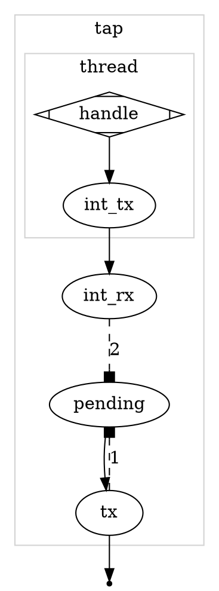
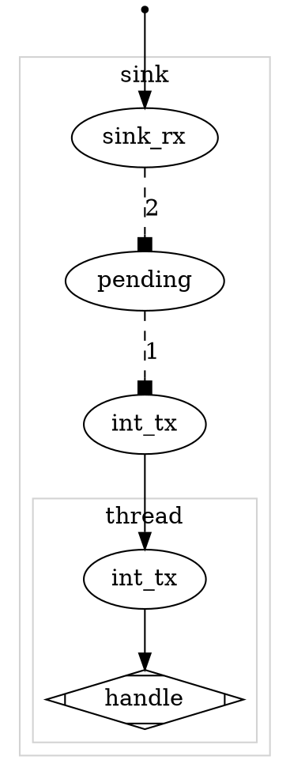
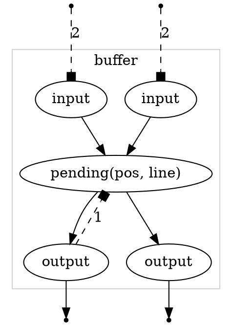
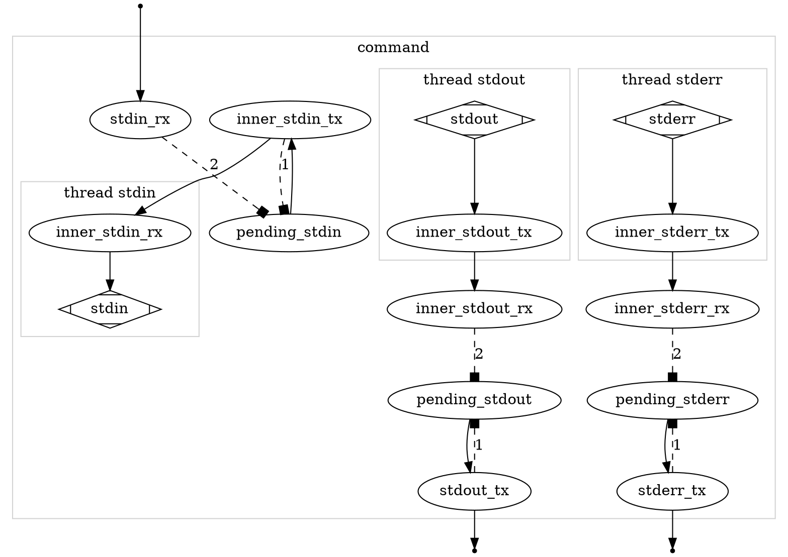

## To start a project

    pipeawesome configuration_file

Will start pipeawesome. If either of `control_fifo` or `orphan_fifo` are not specified they will be created and reported.

Lines which are piped into `pipeawesome` will enter the `INPUT` stream, be processed by multiple `PROCESSORS` and then lines get to `OUTPUT` stream they will be piped out of `pipeawesome`.

```
INPUT -> FIFO -> PROCESSOR -> FIFO -> PROCESSOR -> FIFO -> OUTPUT
```

## Example

jo control=ADD stream=STDIN source=INPUT destination=PRE command=awk args="$(jo -a '{ printf "INPUT: "$1": 0" }')" > config.pa
jo control=ADD stream=STDIN source=PRE destination=MATHS command=awk args="$(jo -a 'BEGIN { FS=":" }{ printf "$1:"$2": "; print $2 | "bc" }')" > config.pa
jo control=ADD stream=STDIN source=MATHS destination=QUALITY_CONTROL command=awk args="$(jo -a 'BEGIN { FS=":" }{ if ($3 < 50) print "COLD:"$2":"$3; else if ($3 == 50) print "RIGHT:"$2": 50"; else print "HOT:"$2":"$3 }' )" > config.pa
jo control=ADD stream=STDIN source=QUALITY_CONTROL destination=FAIL_COLD command=grep args=$(jo -a '^COLD') > config.pa
jo control=ADD stream=STDIN source=QUALITY_CONTROL destination=FAIL_HOT command=grep args=$(jo -a '^HOT') > config.pa
jo control=ADD stream=STDIN source=QUALITY_CONTROL destination=JUST_RIGHT command=grep args=$(jo -a '^RIGHT') > config.pa
jo control=ADD stream=STDIN source=FAIL_HOT destination=MATHS command=awk args="$(jo -a 'BEGIN { FS=":" }{ print $1": "$2" - 1: 0" }')" > config.pa
jo control=ADD stream=STDIN source=FAIL_COLD destination=MATHS command=awk args="$(jo -a 'BEGIN { FS=":" }{ print $1": "$2" + 5: 0" }')" > config.pa
jo control=OUT stream=STDIN source=JUST_RIGHT pre='OUT: '

```
$ echo '3 + 4' | pipeawesome pipeawesome.conf

OUTPUT: STDOUT: JUST_RIGHT: 3 + 4 + 15 + 15 + 15 - 1 - 1: 50
```

## Specifications

### Tap



#### 1

`tx` -> Err - OutputFull
`tx` -> Ok - If sent None - ExhaustedInput

#### 2 - Loop

`int_rx` Ok(line) - Puts data in `pending` and performs `1`
`int_rx` Err(_) - Waiting

### Sink



#### 1 - First step is to process pending

`int_tx` try_send -> Err(_): OutputFull
`int_tx` try_send -> Ok(sent): If sent None ExhaustedInput

#### 2 - If something has just moved out of pending

`rx` Ok(line) - Puts data in `pending` and performs `1`
`rx` Err(_) - Waiting

### Buffer



#### 1 - Sending data out, if possible

After send attempt, if something left in `partially_sent` then: OutputFull
Then if no inputs left then ExhaustedInput.

#### 2 - Pulling data in from externally

`input` try_recv -> Err(Empty) - Waiting
`input` try_recv -> Err(Disconnected) - panic!

### Command



#### 1 - Moving items to pending

If `stdin_rx.try_recv`, `inner_stdout_rx.try_recv()` and `inner_stderr_rx.try_recv()` all failed we will exit with Waiting, but only if nothing happens in 2

#### 2 - Processing Pending

If we could not write to `inner_stdin_tx` then we exit with `InternallyFull` unless we cannot write to `stdout_tx` or `stderr_tx` where we would exit with `OutputFull`

